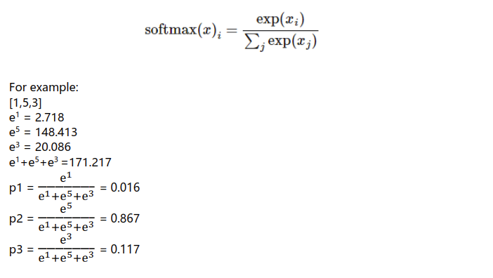
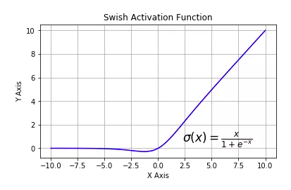

# 5-3,激活函数activation

激活函数在深度学习中扮演着非常重要的角色，它给网络赋予了非线性，从而使得神经网络能够拟合任意复杂的函数。

如果没有激活函数，无论多复杂的网络，都等价于单一的线性变换，无法对非线性函数进行拟合。

目前，深度学习中最流行的激活函数为 relu, 但也有些新推出的激活函数，例如 swish、GELU 据称效果优于relu激活函数。

激活函数的综述介绍可以参考下面两篇文章。

[《一文概览深度学习中的激活函数》](https://zhuanlan.zhihu.com/p/98472075)

https://zhuanlan.zhihu.com/p/98472075

[《从ReLU到GELU,一文概览神经网络中的激活函数》](https://zhuanlan.zhihu.com/p/98863801)

https://zhuanlan.zhihu.com/p/98863801


### 一，常用激活函数


* tf.nn.sigmoid：将实数压缩到0到1之间，一般只在二分类的最后输出层使用。主要缺陷为存在梯度消失问题，计算复杂度高，输出不以0为中心。


* tf.nn.softmax：sigmoid的多分类扩展，一般只在多分类问题的最后输出层使用。



* tf.nn.tanh：将实数压缩到-1到1之间，输出期望为0。主要缺陷为存在梯度消失问题，计算复杂度高。


* tf.nn.relu：修正线性单元，最流行的激活函数。一般隐藏层使用。主要缺陷是：输出不以0为中心，输入小于0时存在梯度消失问题(死亡relu)。


* tf.nn.leaky_relu：对修正线性单元的改进，解决了死亡relu问题。


* tf.nn.elu：指数线性单元。对relu的改进，能够缓解死亡relu问题。


* tf.nn.selu：扩展型指数线性单元。在权重用tf.keras.initializers.lecun_normal初始化前提下能够对神经网络进行自归一化。不可能出现梯度爆炸或者梯度消失问题。需要和Dropout的变种AlphaDropout一起使用。


* tf.nn.swish：自门控激活函数。谷歌出品，相关研究指出用swish替代relu将获得轻微效果提升。



* gelu：高斯误差线性单元激活函数。在Transformer中表现最好。tf.nn模块尚没有实现该函数。


```python

```

### 二，在模型中使用激活函数


在keras模型中使用激活函数一般有两种方式，一种是作为某些层的activation参数指定，另一种是显式添加layers.Activation激活层。

```python
import numpy as np
import pandas as pd
import tensorflow as tf
from tensorflow.keras import layers,models

tf.keras.backend.clear_session()

model = models.Sequential()
model.add(layers.Dense(32,input_shape = (None,16),activation = tf.nn.relu)) #通过activation参数指定
model.add(layers.Dense(10))
model.add(layers.Activation(tf.nn.softmax))  # 显式添加layers.Activation激活层
model.summary()

```
